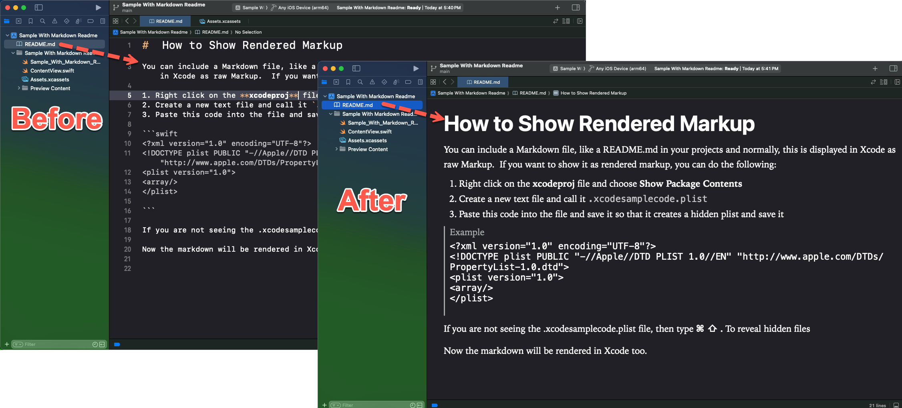

#  How to Show Rendered README.md Markup

You can include a Markdown README.md in your projects and normally, this is displayed in Xcode as raw Markup.  If you want to show it as rendered markup, you can do the following:

1. Right click on the **xcodeproj** file and choose **Show Package Contents**
2. Create a new text file and call it `.xcodesamplecode.plist`
3. Paste this code into the file and save it so that it creates a hidden plist file

```swift
<?xml version="1.0" encoding="UTF-8"?>
<!DOCTYPE plist PUBLIC "-//Apple//DTD PLIST 1.0//EN" "http://www.apple.com/DTDs/PropertyList-1.0.dtd">
<plist version="1.0">
<array/>
</plist>

```

If you are not seeing the .xcodesamplecode.plist file, then type **⌘ ⇧ .** To reveal hidden files

Now the markdown will be rendered in Xcode too.


